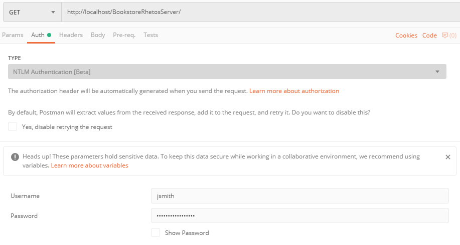
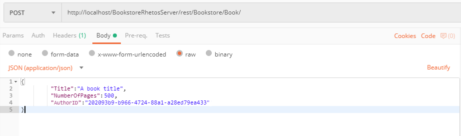
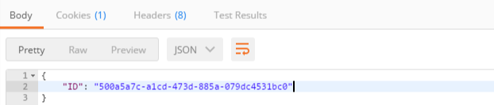
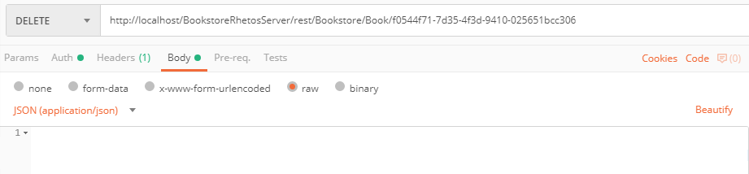

# Using Postman with Rhetos REST Web API

In Postman create a collection for recording all requests. This will simplify and speed up testing of the application.
First choose the authentication type - NTLM, and enter your domain data:



The image below shows the fields used for testing. Using the left dropdown menu
you can select the desired HTTP method (GET, POST, PUT, DELETE, etc.),
while the center field should contain the server URL (server resource).
When the desired method and URL have been entered, hit Send to send the request.

If your request updates the database, then you should select *Body -> raw* and set the format to JSON.




The request is sent to Rhetos through a REST service in the following format: `{Rhetos server URL}/Rest/{Module}/{Entity}/`

The image above shows accessing the BookstoreRestServer application through the REST service,
and then accessing the module Bookstore and its entity Book.
At the the end `/` needs to be added for accessing the resource:
`http://localhost/BookstoreRhetosServer/rest/Bookstore/Book/`
All the requests are sent in the JSON format.

Entities which contain references to other entities are stored in the database
with an "ID" suffix and should be referenced in that way (for example, `AuthorID`).

```c
Entity Book
{
    ShortString Code { AutoCode; }
    ShortString Title { Required; }
    Integer NumberOfPages;
    Reference Author Bookstore.Person;
}
```

JSON:

```json
{
    "Title":"A book title",
    "NumberOfPages":500,
    "AuthorID":null
}
```

After saving in the database, the field below displays either an error or the ID of the newly created object.

```json
{
    "ID": "f0544f71-7d35-4f3d-9410-025651bcc306"
}
```

If we want to fetch the given record, the ID needs to be added in the URL and the GET method need to be selected: `http://localhost/BookstoreRhetosServer/rest/Bookstore/Book/f0544f71-7d35-4f3d-9410-025651bcc306`

When reading a specific record from the database, the URL should not end with `/`.

When deleting a record, you should select the DELETE method and add the ID of the record to the URL. See the image below:



Troubleshooting: If the web request returns an internal server error, you can find additional information
on that error in the [system log](Logging#system-log) file `RhetosServer\Logs\RhetosServer.log`.

You can use Postman collections to save all the web requests for inserting the test data.
At the top of the Postman screen there is a Runner option which is used for running the whole collection at once.

## Method usage summary

xxx = application URI

* GET: xxx/id
* POST: xxx/
* PUT: xxx/id
* DELETE: xxx/id

Rhetos REST API documentation: <https://github.com/Rhetos/RestGenerator/blob/master/Readme.md>
